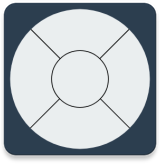

<div>
<h3 style="font-size: 2.2rem; letter-spacing: 1px;">Nope Remote</h3>
<p style="font-size: 1.15rem; font-weight: 500;">
    <strong>Universal IR Remote for Android</strong><br>
    Nope Remote is an open-source Android application that turns your smartphone into a powerful, universal IR remote control. Built with modern Android technologies, it offers a sleek Material You interface and advanced features like Custom Macros to automate your home entertainment system.
  </p>

<div align="center">

[](LICENSE)
  [](https://github.com/monuk7735/nope-remote/issues)
  [](https://github.com/monuk7735/nope-remote/pulls)
  [](https://www.android.com)
  
  <a href="https://f-droid.org/packages/com.monuk7735.nope.remote/">
    
  </a>
  <a href="https://apt.izzysoft.de/fdroid/index/apk/com.monuk7735.nope.remote">
    
  </a>
</div>

## Features

- **Universal Compatibility** - Control TVs, Set-Top Boxes, ACs, and more using your phone's built-in IR blaster.
- **Custom Macros** - Create "Macros" to chain multiple commands together. Turn on your TV, Set-Top Box, and Soundbar with a single tap!
- **Offline Database** - Direct database downloads for seamless offline access without reliance on third-party CDNs.
- **Enhanced Repository Support** - Expanded support for multiple repositories and improved setup process.
- **Performance** - Optimized internal architecture for smoother operation and better maintainability.
- **Material You Design** - A beautiful, modern UI that adapts to your wallpaper's colors (on supported devices).
- **Dark/Light Mode** - Fully supports system-wide dark and light themes.
- **Database Support** - Stores your remotes and macros locally using Room Database.
- **Haptic Feedback** - Get tactile confirmation for every button press.

## Tech Stack

- **Language** - [Kotlin](https://kotlinlang.org/)
- **UI Framework** - [Jetpack Compose](https://developer.android.com/jetpack/compose) (Material 3)
- **Architecture** - MVVM (Model-View-ViewModel)
- **Dependency Injection** - [Dagger Hilt](https://dagger.dev/hilt/)
- **Local Database** - [Room](https://developer.android.com/training/data-storage/room)
- **Networking** - [Retrofit](https://square.github.io/retrofit/)
- **Asynchronous Processing** - Coroutines & Flow

## Getting Started

### Prerequisites

- Use an Android device with a built-in **IR Blaster**.
- Android SDK 33 installed.
- Minimum Android version: 6.0 (API Level 23).

## Installation

1. **Clone the repository:**
   ```bash
   git clone https://github.com/monuk7735/NopeRemote.git
   ```
2. **Open in Android Studio:**
   - Launch Android Studio.
   - Select "Open" and navigate to the cloned directory.
3. **Build and Run:**
   - Let Gradle sync the dependencies.
   - Connect your Android device or start an emulator (Note: Emulators do not support IR transmission).
   - Click the **Run** button (green arrow).

## Usage

1. Launch **Nope Remote**.
2. Tap the **"+"** button on the home screen to add a remote.
3. Select your device type and brand.
4. Test the buttons to find the working configuration and save.
5. Go to the **Macros** tab to create sequences like "Watch Movie" (TV On + Soundbar On + Dim Lights).

## Contributing

Contributions are welcome! Please feel free to open issues or submit pull requests.

## License

This project is licensed under the [GPLv3 License](LICENSE).

## Acknowledgments

- **irdb** - Contains/accesses irdb by Simon Peter and contributors, used under permission. For licensing details and for information on how to contribute to the database, see https://github.com/probonopd/irdb
- **mildsunrise** - For IR protocol implementation insights.
- **pyIRDecoder** - For protocol reference patterns.
